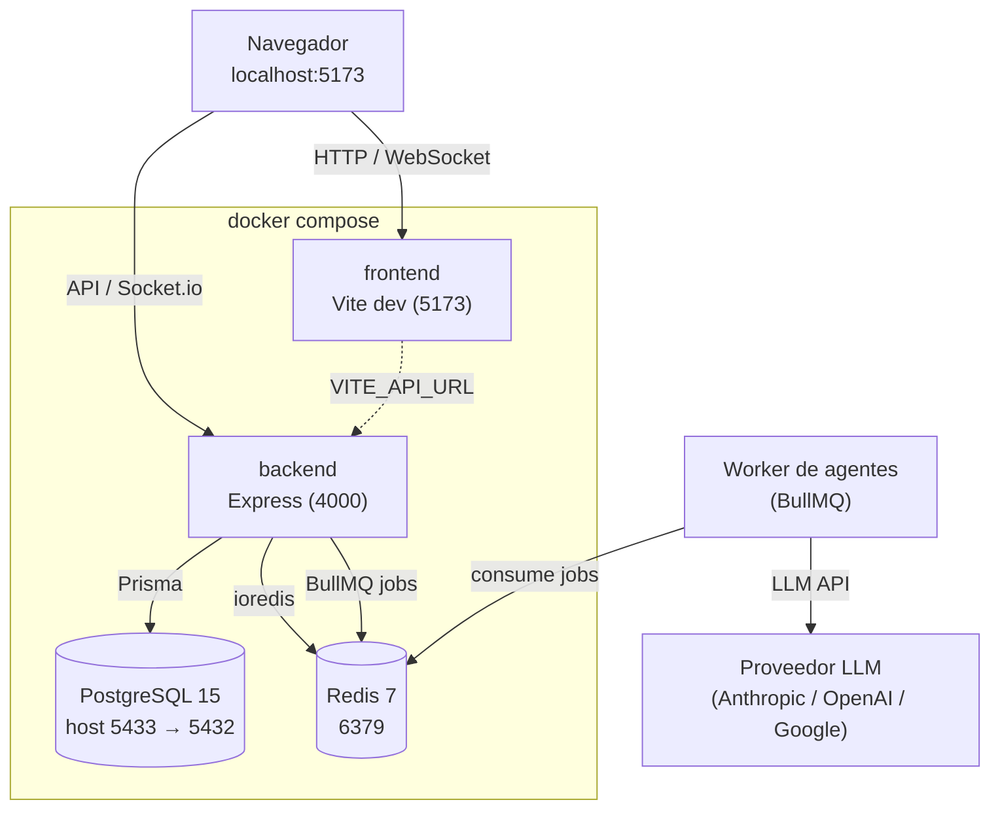

# Arquitectura

Ver [`ESTRUCTURA_PROYECTO.md`](./ESTRUCTURA_PROYECTO.md) para el árbol de
carpetas completo y [`SETUP.md`](./SETUP.md) para levantar el stack.

## Tabla de contenidos
- [Componentes principales](#componentes-principales)
- [Diagrama de infraestructura (local)](#diagrama-de-infraestructura-local)
- [Puertos](#puertos)
- [Flujo de ejecución de un agente](#flujo-de-ejecución-de-un-agente)

---

## Componentes principales

- **Backend** (Express + TypeScript): API REST modular por dominio (`auth`, `users`, `chats`, `agents`, `messages`, `billing`, `webhooks`) + WebSocket (Socket.io) para chat en tiempo real.
- **Frontend** (React + Vite): SPA con Zustand para estado local y TanStack Query para estado de servidor.
- **PostgreSQL**: persistencia principal (Prisma como ORM).
- **Redis**: sesiones, rate limiting, memoria de agentes.
- **BullMQ**: ejecución asíncrona de agentes (job queue) para no bloquear el request HTTP.

---

## Diagrama de infraestructura (local)

Orquestado por [`docker-compose.yml`](../docker-compose.yml). Todos los
servicios comparten la red por defecto de Compose; dentro de esa red el backend
alcanza la BD por el host `postgres:5432` y Redis por `redis:6379`.

---

## Puertos

| Servicio | Host | Contenedor | Notas |
|---|---|---|---|
| Frontend (Vite) | 5173 | 5173 | dev server con hot-reload |
| Backend (Express) | 4000 | 4000 | API + Socket.io + `/health` |
| PostgreSQL | **5433** | 5432 | 5433 en host para evitar choque con un Postgres local |
| Redis | 6379 | 6379 | |

---

## Flujo de ejecución de un agente

1. Un usuario envía un mensaje con `@mención` a un agente en un chat.
2. El backend detecta la mención y encola un job de ejecución (BullMQ sobre Redis).
3. El worker resuelve el proveedor LLM del agente (`services/llm/*`) y ejecuta el prompt con límites de **timeout 60s / 10k tokens / 3 reintentos**.
4. Para acciones críticas el agente pausa y pide confirmación por WebSocket antes de continuar.
5. La respuesta se persiste como mensaje y se emite por WebSocket al chat.

> Los diagramas de secuencia detallados se ampliarán cuando el flujo esté
> implementado end-to-end.
